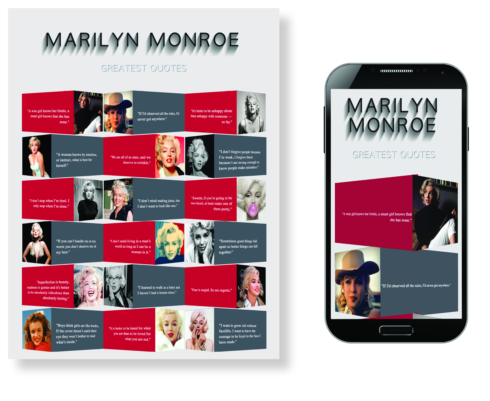

# CSS Grid and Text Shadow Practice 

<h1 align="center">
   
 
</h1>

<h2 align="center">
Practice exercise for CSS grid & perspective layout, and font shadowing. JavaScript is used to make sure items alternate correctly  as the number of items on each row changes.
</h2>
 

## Technologies Used
- Javascript 
 - HTML
 - CSS

To visit deployed application, go to https://southerngirl13.github.io/photoflipcard/